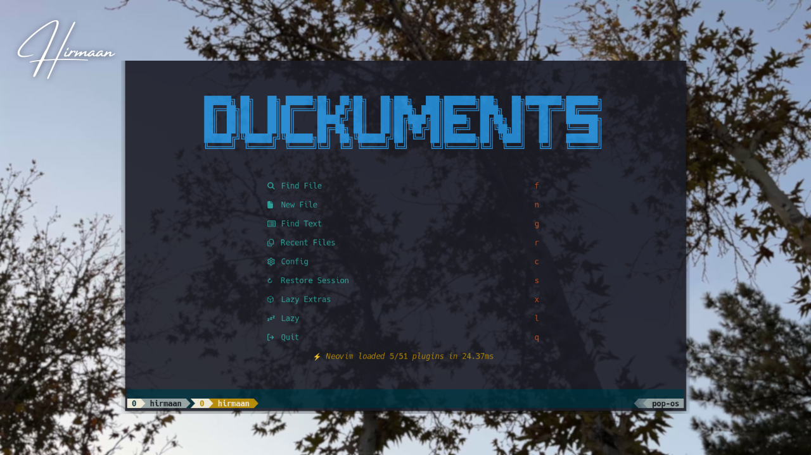
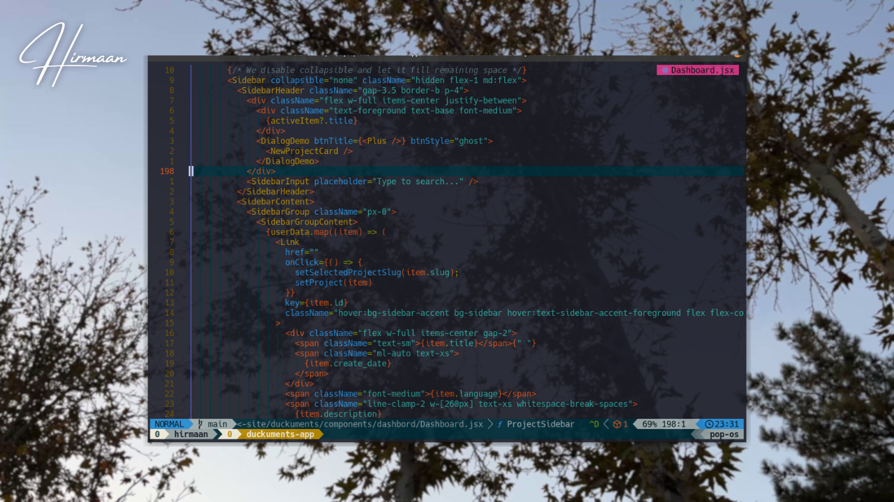

# Dotfiles Configuration

This repository contains my personal configuration files for various development tools.

Inspired by [craftzdog-dotfiles]([https://github.co](https://github.com/craftzdog/dotfiles-public))

## Neovim (nvim/)

Neovim configuration using LazyVim framework. The main entry point is `init.lua`, which enables the loader, sets up debugging utilities, and loads the lazy configuration.

## Kitty (kitty/)

Kitty terminal emulator configuration featuring the Solarized-Osaka theme. Includes custom font (Hack Nerd Font, size 13), background opacity, and padding settings.

## Fish (fish/)

Fish shell configuration with interactive session setup including neofetch display, Homebrew environment variables, useful aliases (vim->nvim, ll->ls -asl, g->git, lg->lazygit), and Anthropic API key exports.

## Lazygit (lazygit/)

Lazygit configuration with a custom command for committing using commitizen (git cz).

## Tmux (tmux/)

Tmux configuration with prefix key set to C-l, vi mode keybindings, custom pane navigation and splitting, window swapping, and theming. Sources additional config files for macOS-specific settings, theme, statusline, and utilities. Uses TPM plugin manager with pain-control plugin.
